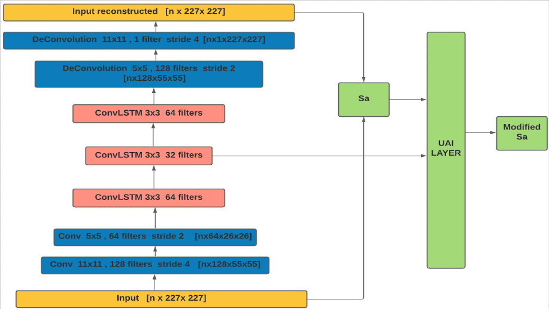
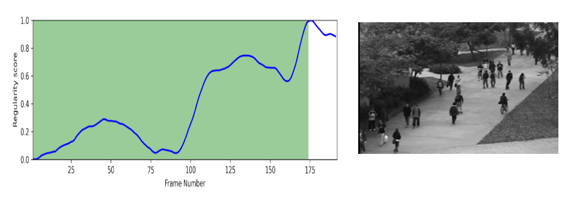

# Abnormal Event Detection in Surveillance Video
*Graduation Project* <br>
[[Undergraduate Graduation Thesis (2021)]](https://drive.google.com/file/d/13MkQzRdagdjAZru75azZ8EbBlQsm38Pi/view?usp=sharing)

### Overview: 

**Abnormal event detection** (AED)- also termed video anomaly detection, is a
relatively popular, but very challenging research problem in the field of computer
vision. The goal is to develop an algorithm that can go through hours of security footage, and flag abnormal events. 
The definition of “abnormal” is heavily context dependent, however, the general
consensus is that an abnormal event should be a fairly rare occurrence; this usually
puts it into the categories of either illegal acts or accidents.<br>

In this project, we aimed to implement a system that can be used in real-time, and can be used in different contexts. 
So, we chose to implement the [Abnormal event detection in videos using spatiotemporal autoencoder (2017)](https://arxiv.org/abs/1701.01546) research paper. 
Also, since AED systems are usually prone to False Positives, we added an [active learning layer](https://arxiv.org/abs/1805.09411) that benefits from user's feedback,
and improves the model's performance over time. 

#### Proposed Model architecture: <br>


### Contents:
````
├── code

├── ├── app

├── ├── model
├── ├──├── models.py
├── ├──├── custom_callback.py
├── ├──├── active_learning_framework.ipynb

├── ├── utils
├── ├──├── dataset_utils.py
├── ├──├── evaluation_utils.py
├── ├──├── general_utils.py
├── ├──├── preprocessing_utils.py
├── ├──├── testing_utils.py
├── ├──├── training_utils.py

├── ├── run_preprocessing.py
├── ├── run_testing.py
├── ├── run_training.py
├── ├── test.ipynb

├── ├── sample_result.png
├── ├── model_architecture.png

├── ├── requirements.txt

├── data
├── config.yml

````
- `app`: directory used for the Streamlit App only
- `model`: directory that contains the models (active learning & autoencoder) definition
- `utils`: utils used in preparing data, training, testing, and evaluation

### Sample Result:
The abnormality of an event is decided based on a regularity score that is based (in this case) on 
the frames reconstruction error. In the example below, the regularity score was low when the frames in the video 
were "normal" (The green area), however, it was at its highest when an abnormal event occurred at
the end of the video. If you zoom in on the video snippet, you can see a man on a bike; this was 
considered an abnormality in this case.


### Model Performance:
We evaluated our model on the UCSDped1 and UCSDped2 datasets. The metrics we used were AUC and EER: <br>
- *In terms of AUC:* <br>
0.601 on UCSDped1 and 0.673 on UCSDped2.

- *In terms of EER:* <br>
0.411 on UCSDped1 and 0.323 on UCSDped2.

### **References:**
- Chong, Yong Shean, and Yong Haur Tay. "Abnormal event detection in videos using spatiotemporal autoencoder." International symposium on neural networks. Springer, Cham, 2017.
-  Pimentel, Tiago, et al. "Deep Active Learning for Anomaly Detection." 2020 International Joint Conference on Neural Networks (IJCNN). IEEE, 2020.
-  Github Repo: https://github.com/drsagitn/anomaly-detection-and-localization

